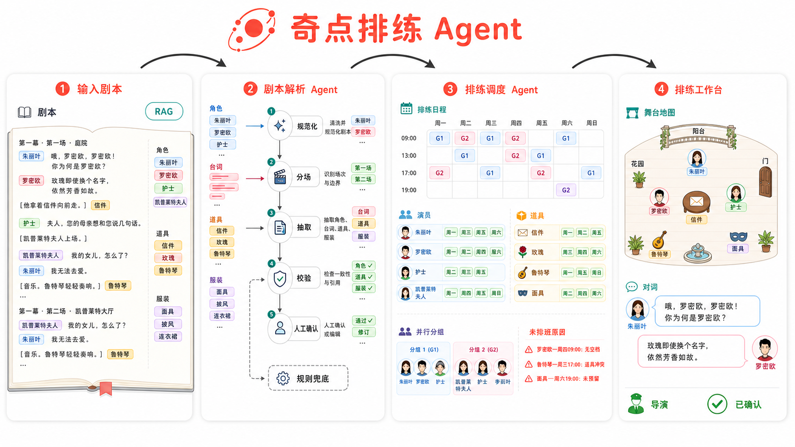
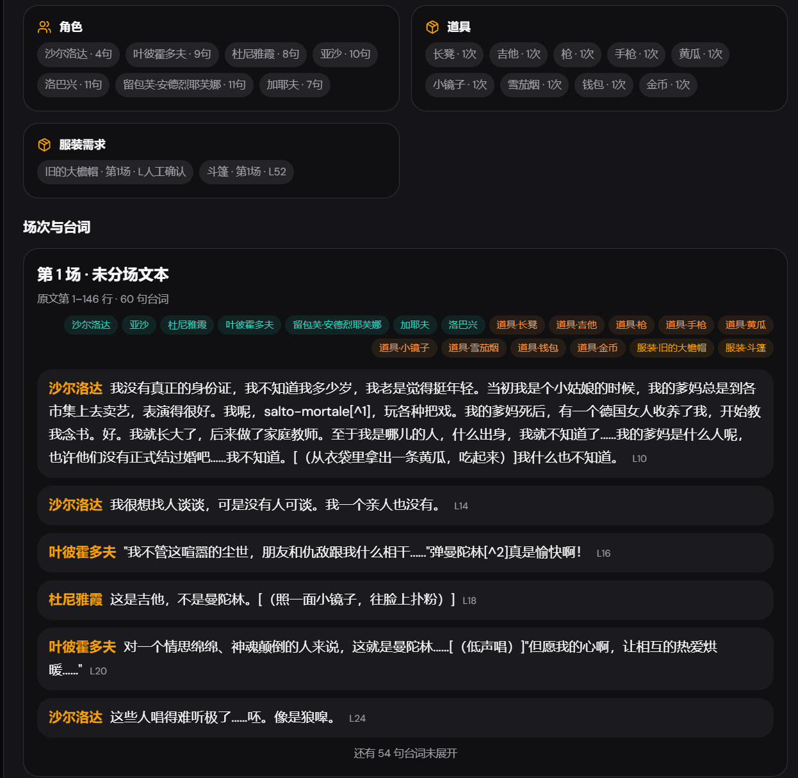
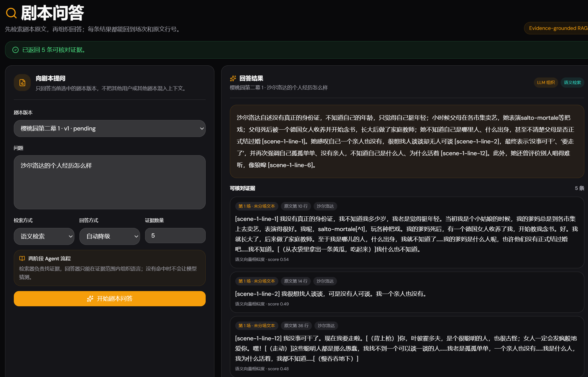
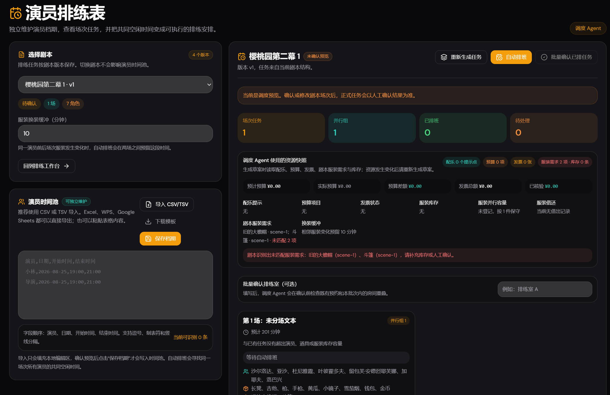
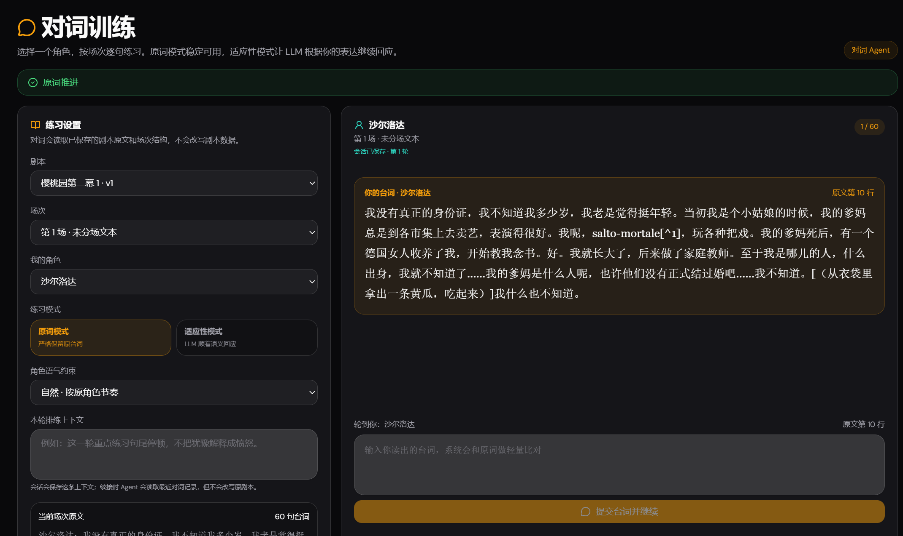
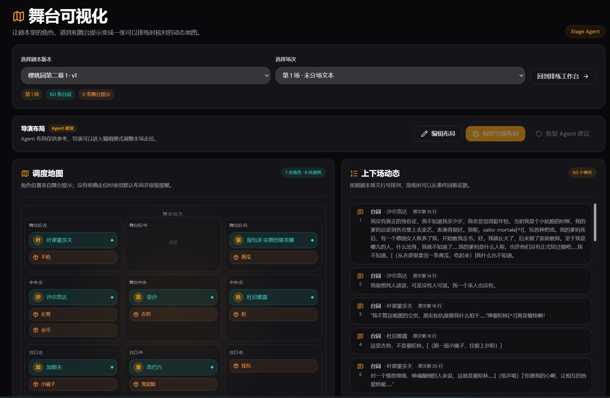

<!-- markdownlint-disable MD033 -->
# 奇点排练 Agent

<p align="center">
  
</p>

<h3 align="center">把剧本、演员、资源与现场经验，组织成一套可执行的排练系统。</h3>

<p align="center">
  面向话剧团的可自部署智能协作平台：剧本解读、排练调度、对词训练、舞台可视化与排练复盘，共享同一份可追溯的排练上下文。
</p>

<p align="center">
  <a href="http://qidianagent.vip">在线体验</a> ·
  <a href="docs/rehearsal-agent.md">产品与架构说明</a> ·
  <a href="docs/deployment.md">部署指南</a> ·
  <a href="docs/agent-evaluation.md">Agent 评估集</a>
</p>

<p align="center">
  <a href="https://github.com/cartonmouse/qidian-rehearsal-agent/actions/workflows/ci.yml"></a>
  <a href="LICENSE"></a>
  <a href="https://github.com/cartonmouse/qidian-rehearsal-agent"></a>
</p>

<p align="center">
  
</p>

## 为什么需要奇点排练

排练现场的信息往往分散在剧本、群聊、表格、道具清单和导演的临场决定里。奇点排练把这些信息组织成一个工作上下文：

- 剧本内容可以回到原文行号；
- Agent 的识别结果可以由导演确认和修改；
- 演员档期、道具、服装和排练室会参与排班约束；
- 不能排班时会说明具体原因，而不是只返回“失败”；
- 舞台布局既可以由 Agent 起草，也可以由导演直接编辑；
- 每次 Agent 运行、版本变化和现场反馈都能被复盘。

它不是一个只会生成文案的聊天窗口，而是一套围绕排练状态、约束和现场协作设计的工具。

## 产品界面

首页图用于概括产品工作流，下面是来自真实本地测试的功能截图。截图中的剧本、角色和数字均为示例数据，不代表固定的业务内容。

<details open>
<summary>查看真实功能界面</summary>

<table>
  <tr>
    <td width="50%">
      
      <p align="center"><b>剧本解析与结构化结果</b><br>角色、道具、服装、场次、台词和原文行号</p>
    </td>
    <td width="50%">
      
      <p align="center"><b>证据约束的剧本问答</b><br>回答引用当前剧本版本的可核对证据</p>
    </td>
  </tr>
  <tr>
    <td width="50%">
      
      <p align="center"><b>调度 Agent 与自动排班</b><br>演员档期、任务、资源、换装缓冲和未排班原因</p>
    </td>
    <td width="50%">
      
      <p align="center"><b>有状态对词 Agent</b><br>角色、场次、台词游标和原词/适应性练习模式</p>
    </td>
  </tr>
  <tr>
    <td colspan="2">
      
      <p align="center"><b>舞台可视化与导演编辑</b><br>Agent 提供布局建议，导演可以编辑人物、道具和上下场动态</p>
    </td>
  </tr>
</table>

</details>

## 功能一览

### 剧本工作台

- 支持 TXT、Markdown 和可提取文本的 PDF；
- 识别场次、角色、台词、舞台提示、道具和服装需求；
- 保留来源文件、原文摘录和行号；
- 支持规则解析、可选 LLM 结构化抽取和单场 fallback；
- 导演可在人工确认节点修改场次、角色、道具和服装标签。

### 排练调度与自动排班

- 生成场次任务、演员/道具/服装清单和预计时长；
- 导入或粘贴演员可用时间，支持 CSV/TSV 及表格导出内容；
- 计算全部演员的共同空闲区间；
- 将演员、道具、服装、换装缓冲和排练室纳入冲突检查；
- 把不共享资源的任务分成并行组；
- 输出缺少档期、没有共同时间、资源不足等未排班原因；
- 支持导演单条或批量人工覆盖，批量确认采用原子写入。

### 对词、RAG 与舞台

- 原词模式无需模型服务，适应性模式可使用 LLM 生成对方回应；
- 对词会话保存游标、transcript、角色语气和排练上下文；
- 剧本问答只检索当前剧本版本，回答引用可回到原文证据；
- 无证据时停止猜测，语义检索不可用时回退规则检索；
- 根据舞台提示生成角色、道具和上下场动态；
- 导演可以新增、重命名、移除、隐藏或拖动人物/道具，并复用用户标签。

### 资源与排练资产

- 道具/服装库存、借出归还、多人分配和容量检查；
- 排练室预约、配乐时间轴、预算和发票元数据；
- 场记档案、演员建议收件箱和排练反馈；
- 版本差异、资源审计、排练度量和 Agent 运行记录；
- 格言沉淀与宣传文案生成。

## 一次排练如何流动

```text
剧本 / 档期 / 资源
        │
        ▼
剧本解读 Agent ──► 人工确认 ──► 调度 Agent ──► 自动排班
        │                              │
        ├──► 剧本问答 RAG               ├──► 并行任务组
        ├──► 对词训练                  ├──► 未排班原因
        └──► 舞台可视化                └──► 人工覆盖与审计
                                               │
                                               ▼
                                  场记 / 反馈 / 版本 / 知识资产
```

这些模块可以独立使用。演员时间池不要求先解析剧本，舞台可视化也不要求把所有任务串成一条流水线；推荐路径只是帮助剧团从文本快速走到一次可执行排练。

## Agent 设计

奇点排练采用“模型理解 + 确定性约束 + 人工控制”的组合：

| Agent/模块 | 负责什么 |
| --- | --- |
| 剧本解读 Agent | 将开放文本转成带来源证据的场次和排练需求 |
| 调度 Agent | 生成任务，调用档期/资源工具并解释排班结果 |
| RAG Agent | 检索当前剧本版本的证据并约束回答 |
| 对词 Agent | 维护角色、游标、语气和上下文的有状态会话 |
| Stage Agent | 由舞台提示生成可编辑的导演布局 |
| 复盘/资源 Agent | 把现场反馈、资源变化和版本影响变成可追踪记录 |

### 可靠性边界

- **原文优先**：LLM 只提交结构化候选，台词和来源行号重新与原文校验；
- **结构化输出**：Pydantic 模型检查字段、行号、场次和资源引用；
- **局部降级**：单场 LLM 失败回退规则解析，语义检索失败回退关键词检索；
- **约束守门**：共同档期、资源容量、换装间隔和房间冲突由确定性逻辑检查；
- **证据约束**：RAG 没有证据就停止回答，答案引用必须能回到剧本；
- **人工可控**：导演可以修改确认结果、人工排班和舞台布局，并保留 Agent 原建议；
- **可观测**：运行记录保存步骤、工具调用、耗时、状态和降级原因。

LLM 和 Embedding 都是可选服务。没有模型 API 时，剧本规则解析、调度、自动排班、原词对词、规则 RAG、舞台可视化、资源管理和反馈归档仍可运行。

## 技术架构

| 层 | 技术与职责 |
| --- | --- |
| Web | React、Vite、Tailwind CSS、Radix UI |
| API | Python 3.11+、FastAPI、Pydantic |
| Agent | 显式状态编排、并行节点、工具调用、结构化输出、校验与 fallback |
| RAG | 当前剧本版本内的 source_line 证据检索 |
| Storage | SQLite 保存账号与索引，JSON 保存用户领域数据 |
| Providers | OpenAI-compatible LLM/Embedding，可选本地 SentenceTransformer |
| Deploy | Docker Compose、Nginx、Uvicorn |
| Quality | Python 回归测试、离线 Agent 评估、前端检查和 CI |

## 快速开始

### 环境要求

- Python 3.11+
- Node.js 18+
- Git

### 本地开发

```bash
# Windows PowerShell
Copy-Item .env.example .env
# macOS / Linux
cp .env.example .env
pip install -r requirements.txt
uvicorn backend.main:app --reload --port 18000
```

另开终端启动前端：

```bash
cd frontend
npm install
npm run dev
```

打开 http://localhost:5173。

### Docker

```bash
docker compose up --build
```

打开 http://localhost。容器会提供前端、API 反向代理和 /health 健康检查。

## 模型服务配置

项目可以先以规则模式运行，再按需接入模型：

- LLM 用于适应性对词、LLM 复盘、宣传文案和 RAG 答案组织；
- Embedding 用于剧本语义检索；
- 本地 Embedding 支持 HuggingFace/SentenceTransformer 模型和本地路径；
- 模型设置可以在登录后的设置页按用户保存；
- 不要把 API Key、.env、个人剧本或 data/users/ 提交到 Git。

OpenAI-compatible LLM 示例：

```env
API_BASE=https://your-provider.example/v1
API_KEY=your-api-key
MODEL=your-model
```

远程 Embedding 示例：

```env
EMBEDDING_BACKEND=api
EMBEDDING_API_BASE=https://your-embedding-provider.example/v1
EMBEDDING_API_KEY=your-embedding-key
EMBEDDING_API_MODEL=your-embedding-model
```

完整环境变量、本地模型依赖和线上安全配置见 docs/deployment.md。

## 示例数据

- [示例剧本：奇点排练](docs/examples/qidian-demo-script.md)
- [示例剧本：回声室](docs/examples/qidian-echo-room-script.md)
- [可排班演员档期](docs/examples/qidian-actor-availability-feasible.csv)
- [无共同时间的冲突档期](docs/examples/qidian-actor-availability.csv)

推荐体验路径：

1. 上传示例剧本并运行剧本解读 Agent；
2. 在人工确认中调整一个角色或道具；
3. 导入演员档期，生成调度草案并运行自动排班；
4. 在舞台可视化中编辑一个标签；
5. 用剧本问答、对词和 Agent 运行记录检查结果。

## API 入口

所有排练 API 都需要当前用户的 Bearer Token。常用接口包括：

| 能力 | API |
| --- | --- |
| 解析剧本 | POST /api/rehearsal/scripts/parse、POST /api/rehearsal/scripts/parse-file |
| 人工确认 | PUT /api/rehearsal/scripts/{script_id}/review |
| 演员时间池 | GET/PUT /api/rehearsal/availability |
| 调度草案 | POST /api/rehearsal/scripts/{script_id}/schedule/draft |
| 自动排班 | POST /api/rehearsal/scripts/{script_id}/schedule/plan |
| 剧本问答 | POST /api/rehearsal/scripts/{script_id}/rag |
| 对词会话 | POST /api/rehearsal/scripts/{script_id}/line-reading |
| 舞台布局 | GET/PUT /api/rehearsal/scripts/{script_id}/stage/{scene_id} |
| 资源检查 | POST /api/rehearsal/scripts/{script_id}/resources/check |
| Agent 运行记录 | GET /api/rehearsal/agent-runs |

完整接口以运行中的 FastAPI OpenAPI 文档为准：

- http://localhost:18000/docs
- http://localhost:18000/openapi.json

## 数据与隐私

```text
data/
├── interviews.db
└── users/
    └── <uid>/
        ├── provider.json
        └── rehearsal/
            ├── scripts/
            ├── schedules/
            ├── agent-runs/
            ├── stage-overrides/
            ├── stage-tags.json
            ├── line-reading-sessions/
            ├── availability.json
            └── resources/
```

账号和索引写入 SQLite，用户领域数据按 uid 写入 JSON 和目录。公开部署时请使用自己的 JWT 密钥，关闭或保护开放注册，并为数据目录配置备份和访问权限。公共演示环境不适合上传未公开剧本、个人信息或真实密钥。

## 质量检查

```bash
python -m compileall -q backend
python -m evals.run_rehearsal_evals

cd frontend
npm run typecheck
npm test
npm run lint
npm run build

docker compose config
```

离线评估集不依赖真实 LLM 或 Embedding，重点验证剧本来源锚定、调度约束、工具调用链、RAG 证据/拒答、对词会话恢复和用户隔离。

## 项目结构

```text
backend/
├── rehearsal/        剧本、调度、RAG、对词和舞台领域服务
├── routers/          FastAPI 路由
├── storage/          用户设置与持久化
└── app.py            应用组装与健康检查
frontend/
├── src/components/   排练工作台与领域组件
├── src/api/          前后端接口
└── public/           奇点图标与静态资源
evals/                离线 Agent 评估案例
docs/                 产品、部署、评估与领域说明
deploy/               公开服务 Docker/Nginx 配置
```

## 文档

- [排练 Agent 设计说明](docs/rehearsal-agent.md)
- [Agent 评估集](docs/agent-evaluation.md)
- [部署指南](docs/deployment.md)
- [外部服务配置](docs/external-services.md)

## Roadmap

- 演员档期确认通知与日历同步；
- 更完整的多人协同编辑和权限角色；
- PostgreSQL、对象存储和异步任务队列；
- 语音对词、发音反馈和情绪练习；
- 更强的剧本版本合并与排练影响分析；
- 多房间、多剧组的并发排练管理。

## 参与贡献

欢迎通过 Issue 反馈真实排练场景、数据格式和体验问题，也欢迎提交 Pull Request。贡献前请先运行质量检查，并避免提交个人剧本、账号数据、模型密钥和本地缓存。

## 独立项目与许可

奇点排练 Agent 是面向话剧排练场景维护的独立项目。项目早期复用了 [TechSpar](https://github.com/AnnaSuSu/TechSpar) 的 Python/FastAPI 工程基线和部分通用基础设施；当前产品名称、领域模型、排练工作流、Agent 能力和前端主导航均围绕话剧排练独立演进。历史基线说明见 docs/adr/0001-clean-python-derived-base.md。

本项目遵循仓库中的 [CC BY-NC 4.0](LICENSE) 许可。使用或二次开发时请同时遵守上游依赖和素材各自的许可条款。

## 项目链接

- 在线体验：http://qidianagent.vip
- GitHub：https://github.com/cartonmouse/qidian-rehearsal-agent
- 剧团名称：奇点
